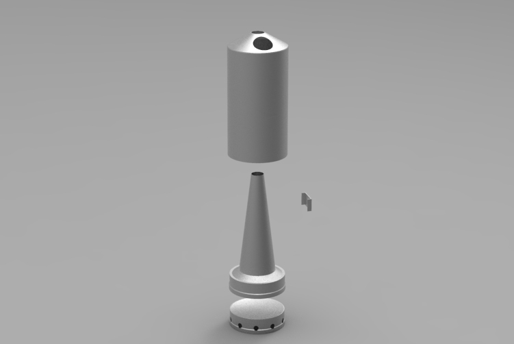

# Aluminium Spun Kettle

Inspired by chimney style stove, like the Kelly Kettle, but made to work with alcohol. 

The goal was to design a lightweight and cheap stove, that would be highly efficient. 

The PDF file was sent to a manufacturer, unfortunately I needed to pay 300$ for the first 5 prototypes, which was not cash I had laying around.

If you are interested, I found out later the [Mkettle](http://www.mkettle.com/) was ticking all my boxes!
